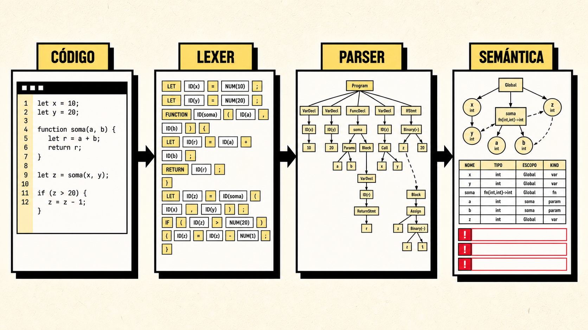
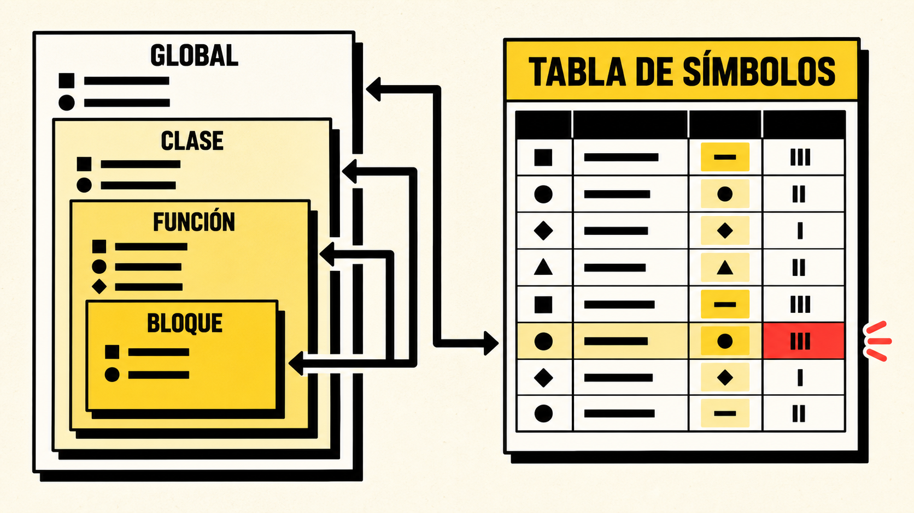

<div align="center">



# Compiscript Semantic IDE

### Del código fuente al significado, con evidencia visible

IDE académico para ejecutar y explicar las fases léxica, sintáctica y semántica de Compiscript mediante ANTLR 4, TypeScript y React.

[](https://www.antlr.org/)
[](https://www.typescriptlang.org/)
[](https://react.dev/)
[](https://vite.dev/)
[](https://www.electronjs.org/)
[](compiscript-ide-work/src/__tests__)

[](https://github.com/DanielBarillasM/Proyecto-01_CDC_seccion-10_Grupo-DragonsSlayers-2.0/releases/tag/Compiscript-Semantic-IDE-V1.2.0)

[Descargar portable](#descargar-versión-portable) · [Inicio rápido](#inicio-rápido) · [Capacidades](#qué-demuestra) · [Ejemplos](#ejemplos-preparados-para-la-rúbrica) · [Arquitectura](#arquitectura) · [Documentación](#documentación-y-exposición)

</div>

---

## Descargar versión portable

La distribución recomendada para Windows es **Compiscript Semantic IDE V1.2.0 Portable**:

**[Abrir el release oficial V1.2.0 y descargar la versión portable](https://github.com/DanielBarillasM/Proyecto-01_CDC_seccion-10_Grupo-DragonsSlayers-2.0/releases/tag/Compiscript-Semantic-IDE-V1.2.0)**

1. Abra el enlace del release.
2. Despliegue la sección **Assets**.
3. Descargue el archivo portable de Windows.
4. Ejecute el archivo directamente; no requiere instalación.

> El instalador tradicional no se distribuye ni se recomienda para esta versión porque presentó problemas durante la instalación y ejecución. El release incluye únicamente la modalidad portable, que evita modificar el sistema y puede eliminarse borrando su archivo.

Compatibilidad prevista: Windows 10/11 de 64 bits. Como el ejecutable académico no posee una firma digital comercial, Windows SmartScreen puede solicitar confirmación antes de abrirlo.

> La versión portable V1.2.0 representa el corte estable más reciente publicado. La rama `main` contiene cambios posteriores, entre ellos el panel de pruebas del IDE, testers separados por fase y empaquetado macOS/Linux; para obtener exactamente el estado actual del repositorio debe ejecutarse `npm run exe:portable` desde el código fuente vigente.

### Ejecutable para macOS y Linux

No hay release publicado para macOS/Linux. Los artefactos deben generarse en un entorno compatible: macOS local o un runner macOS para `.zip`/`.dmg`, y Linux nativo, WSL o Docker para AppImage. No se requiere certificado comercial para estas compilaciones académicas:

```bash
cd compiscript-ide-work
npm install
npm run exe:mac     # macOS: .zip y .dmg sin firmar (Intel y Apple Silicon)
npm run exe:linux   # Linux: AppImage x64, no requiere instalación
```

Desde Windows, se recomienda ejecutar el build Linux dentro de WSL; la construcción directa sobre NTFS puede fallar cuando AppImage intenta crear enlaces simbólicos. El build de macOS no debe darse por reproducible desde Windows: utilice una Mac o un runner `macos-latest` de GitHub Actions.

Los artefactos quedan en `compiscript-ide-work/release/`. Al igual que el portable de Windows, no llevan firma/notarización comercial: en macOS puede ser necesario click derecho → Abrir la primera vez (Gatekeeper); el AppImage solo necesita permiso de ejecución (`chmod +x`).

Verificado en macOS (arm64, Electron directo) y en Linux nativo (arm64, dentro de un contenedor con Xvfb): la aplicación arranca, renderiza el IDE completo y no genera errores además de avisos benignos de D-Bus ausente en entornos mínimos. Si el AppImage falla con `libz.so: cannot open shared object file`, instale zlib (`apt install zlib1g` deja solo `libz.so.1`; los escritorios Linux habituales ya traen la variante sin versión, los contenedores mínimos no).

## Vista rápida

| IDE | Análisis semántico | Tabla de símbolos |
| --- | --- | --- |
| Editor `.cps`, casos cargables, navegación por fases y exportaciones | Tipos, funciones, flujo, clases, herencia, arreglos y 23 códigos estables | Inserción, recuperación, actualización, ámbitos, referencias, shadowing y closures |

```text
código .cps
   -> lexer ANTLR
   -> token stream
   -> parser ANTLR y CST
   -> hoisting local de declaraciones
   -> Visitor semántico
   -> diagnósticos + símbolos + ámbitos + árbol anotado
```

> La fase semántica solo se ejecuta cuando lexer y parser terminan sin errores. Así se evitan diagnósticos falsos sobre un árbol recuperado o incompleto.

## Información académica

| Campo | Información |
| --- | --- |
| Universidad | Universidad del Valle de Guatemala |
| Curso | Construcción de Compiladores, CC-3032 |
| Sección | 10 |
| Catedrático | Ing. Carlos Valdéz |
| Entrega | Proyecto 1, análisis semántico |
| Grupo | DragonsSlayers 2.0 |

| Integrante | Carné |
| --- | ---: |
| Pablo Daniel Barillas Moreno | 22193 |
| Hugo Daniel Barillas Ajín | 23556 |
| Ernesto Ascencio | 23009 |

## Inicio rápido

El proyecto ejecutable se encuentra en `compiscript-ide-work`:

```bash
cd compiscript-ide-work
npm install
npm run dev
```

Abrir `http://localhost:3000`.

### Validación completa

```bash
npm run generate
npm run check
npm test
npm run build
```

Estado verificado del repositorio actual: **115 pruebas aprobadas en 7 suites**, comprobación de TypeScript sin errores y build de Vite completado con **3368 módulos transformados**.

Requisitos recomendados:

- Node.js 20 o superior;
- npm;
- Java únicamente para regenerar ANTLR.

## Qué demuestra

### Sistema de tipos

- `integer`, `float`, `boolean`, `string`, `null`, arreglos, funciones, clases e instancias;
- operadores aritméticos, lógicos, comparaciones y ternario;
- promoción segura `integer -> float`;
- inferencia de variables, campos y retornos;
- constantes inicializadas y no reasignables;
- arreglos homogéneos e índices enteros.

### Ámbitos y tabla de símbolos

- entornos globales, de función, clase, bloque, ciclo, `switch` y `catch`;
- resolución local/global y shadowing en ámbitos hijos;
- inserción con `declare`, recuperación con `resolve`, actualización con `updateSymbol`;
- conteo de referencias y variables capturadas por closures;
- identidades de clase independientes del nombre textual.

<div align="center">



</div>

### Funciones y flujo

- firmas, parámetros, aridad y tipos posicionales;
- recursión, referencias adelantadas y funciones anidadas;
- inferencia de retorno sin anotación;
- condiciones booleanas;
- uso contextual de `return`, `break` y `continue`;
- detección de código inalcanzable.

### Clases y estructuras

- campos, métodos, constructores explícitos e implícitos;
- herencia, ciclos, `this` y acceso heredado;
- clases locales y clases homónimas en ámbitos hermanos;
- arreglos multidimensionales y tipo de iteración en `foreach`.

## Interfaz orientada a la explicación

La vista semántica utiliza un workbench de tres áreas:

1. una guía lateral explica el pipeline, los casos y la gramática activa;
2. el editor concentra la escritura, carga y ejecución del programa;
3. el explorador organiza resumen, diagnósticos, símbolos, ámbitos, árboles y **pruebas** en pestañas.

La pestaña **Pruebas** (ícono de matraz) del explorador muestra, dentro del propio IDE, los mismos casos que corren en `npm test`: pruebas predeterminadas de lexer, parser y semántica que se ejecutan con un clic, cada una con su resultado esperado y notas de por qué falló si aplica. Cualquier prueba (predeterminada o propia) se puede eliminar, y el botón "Agregar prueba" permite escribir código, la fase y el resultado esperado (aceptado/rechazado, cantidad de errores, códigos `SEM`) para crear casos propios; las eliminaciones y adiciones se guardan en el navegador (`localStorage`) y "Restaurar predeterminadas" revierte los borrados.

Atajos principales:

| Acción | Atajo |
| --- | --- |
| Ejecutar análisis | `Ctrl + Enter` |
| Limpiar/restaurar | `Ctrl + L` |
| Copiar código | Botón `Copiar` del editor |

## Ejemplos preparados para la rúbrica

La carpeta [examples/semantic](compiscript-ide-work/examples/semantic) contiene ejemplos semánticos verificables. Los casos fallidos mantienen lexer y parser válidos para aislar la regla que se quiere presentar.

| Caso | Cobertura |
| --- | --- |
| `valid_complete.cps` | Demostración integral sin errores |
| `symbol_table_demo.cps` | Inserción, recuperación, actualización, ámbitos, referencias y closures |
| `errors_types.cps` | Tipos, operadores, constantes y condiciones |
| `errors_scopes.cps` | Resolución, redeclaración, parámetros e inicialización |
| `errors_functions.cps` | Firmas, argumentos, retornos e invocaciones |
| `errors_flow.cps` | Condiciones, terminadores, código muerto y `switch` |
| `errors_classes.cps` | Miembros, constructores, `this` y herencia |
| `errors_arrays.cps` | Homogeneidad e indexación |

Ejecutar un caso:

```bash
cd compiscript-ide-work
npm run cli -- examples/semantic/valid_complete.cps --mode semantic
npm run cli -- examples/semantic/errors_classes.cps --mode semantic
```

La tabla de códigos esperados y los comandos completos están en [examples/semantic/README.md](compiscript-ide-work/examples/semantic/README.md). La suite `projectExamples.test.ts` verifica automáticamente sus resultados.

## Arquitectura

```text
compiscript-ide-work/
├── src/
│   ├── grammars/          fuente ANTLR
│   ├── generated/         lexer, parser y Visitor generados
│   ├── lib/               pipeline, errores, árboles y exportaciones
│   ├── semantic/          tipos, símbolos, declaraciones, flujo y Visitor
│   ├── ui/                aplicación y componentes React
│   └── __tests__/         testers de lexer, parser, semántica y rúbrica
├── examples/
│   ├── semantic/          casos vigentes del Proyecto 1
│   ├── compiscript/       ejemplos integrados de la interfaz
│   └── rubric/            regresiones de lexer/parser
├── docs/                  documentación técnica vigente
└── presentation/          presentación HTML y recursos visuales
```

Módulos clave:

| Archivo | Responsabilidad |
| --- | --- |
| `src/lib/analyze.ts` | Orquesta las tres fases y produce `AnalyzeResult` |
| `src/semantic/declarationVisitor.ts` | Predeclara clases, miembros, firmas y herencia |
| `src/semantic/semanticVisitor.ts` | Recorre el CST y aplica las reglas |
| `src/semantic/scopes.ts` | Administra símbolos y entornos léxicos |
| `src/semantic/typeSystem.ts` | Centraliza compatibilidad, inferencia y operadores |
| `src/semantic/flowAnalysis.ts` | Analiza terminación y código inalcanzable |

## Diagnósticos

<details>
<summary>Mostrar catálogo SEM001–SEM023</summary>

| Código | Regla | Código | Regla |
| --- | --- | --- | --- |
| `SEM001` | Identificador no declarado | `SEM013` | Uso inválido de `this` |
| `SEM002` | Redeclaración | `SEM014` | Clase o invocación inválida |
| `SEM003` | Asignación incompatible | `SEM015` | Índice no entero |
| `SEM004` | Operador inválido | `SEM016` | Valor no indexable |
| `SEM005` | Condición no booleana | `SEM017` | Arreglo heterogéneo |
| `SEM006` | Aridad incorrecta | `SEM018` | Código inalcanzable |
| `SEM007` | Argumento incompatible | `SEM019` | Parámetro duplicado |
| `SEM008` | Retorno incompatible | `SEM020` | Herencia inválida/circular |
| `SEM009` | `return` fuera de función | `SEM021` | `switch` incompatible |
| `SEM010` | `break` fuera de contexto | `SEM022` | Reservado |
| `SEM011` | `continue` fuera de contexto | `SEM023` | Uso antes de inicialización |
| `SEM012` | Miembro inexistente | | |

</details>

## CLI y escritorio

```bash
# CLI semántica
npm run cli:semantic-valid
npm run cli:semantic-errors
npm run cli:semantic-symbols
npm run test:examples

# Aplicación Electron
npm run desktop

# Artefactos de escritorio
npm run exe:portable   # Windows portable (modalidad del release V1.2.0)
npm run exe:installer  # Windows NSIS (no recomendado para distribuir)
npm run exe:mac        # macOS .zip / .dmg, x64 y arm64, sin firmar
npm run exe:linux      # Linux AppImage x64
```

`exe:portable` genera la modalidad usada por el [release V1.2.0](https://github.com/DanielBarillasM/Proyecto-01_CDC_seccion-10_Grupo-DragonsSlayers-2.0/releases/tag/Compiscript-Semantic-IDE-V1.2.0). `exe:mac` y `exe:linux` no requieren certificado de firma, igual que el portable de Windows.

## Decisiones frente al enunciado

- Se añadió `float` porque el requisito semántico lo exige aunque la gramática base no lo incluya.
- Las estructuras de control requieren bloques con llaves porque así lo define la gramática ANTLR oficial.
- `switch` usa discriminante escalar y casos comparables porque los ejemplos oficiales emplean `case 1`, aunque una frase del enunciado lo agrupe con condiciones booleanas.
- Las clases respetan el ámbito de declaración; una clase local no se hace global.

La justificación completa está en [DECISIONES_SEMANTICAS.md](compiscript-ide-work/docs/DECISIONES_SEMANTICAS.md).

## Documentación y exposición

| Recurso | Contenido |
| --- | --- |
| [Arquitectura](compiscript-ide-work/docs/ARQUITECTURA_PROYECTO_1.md) | Pipeline, módulos e invariantes |
| [Decisiones semánticas](compiscript-ide-work/docs/DECISIONES_SEMANTICAS.md) | Políticas y contradicciones entre fuentes |
| [Auditoría](compiscript-ide-work/docs/AUDITORIA_PROYECTO_1.md) | Hallazgos, correcciones y resultados |
| [Matriz de requisitos](compiscript-ide-work/docs/MATRIZ_REQUISITOS.md) | Trazabilidad de la rúbrica |
| [Informe PDF](compiscript-ide-work/docs/informe/INFORME_PROYECTO_01.pdf) | Documento académico listo para entrega |
| [Fuente LaTeX](compiscript-ide-work/docs/informe/INFORME_PROYECTO_01.tex) | Versión editable del informe |
| [Presentación HTML](compiscript-ide-work/presentation/compiscript-proyecto-1.html) | Exposición interactiva de 17 diapositivas |

## Pruebas

```bash
cd compiscript-ide-work
npm test
```

La batería (115 pruebas en 7 suites) separa un tester por fase para que cada uno sea identificable de forma independiente:

| Tester | Archivo | Fase | Cobertura |
| --- | --- | --- | --- |
| Lexer | [`src/__tests__/lexer.test.ts`](compiscript-ide-work/src/__tests__/lexer.test.ts) | léxico | tokenización, errores de reconocimiento, cadenas sin cerrar, escapes inválidos, límite de cascadas |
| Parser | [`src/__tests__/parser.test.ts`](compiscript-ide-work/src/__tests__/parser.test.ts) | sintáctico | aceptación, CST, recuperación de errores, interacción lexer→parser |
| Semántico | [`src/__tests__/semantic/`](compiscript-ide-work/src/__tests__/semantic/) (`semanticAnalyzer`, `scopeManager`, `projectExamples`) | semántico | `SEM001`–`SEM023`, `ScopeManager` (insertar/recuperar/actualizar/ámbitos), closures, herencia, ejemplos de exposición |
| Rúbrica | [`src/__tests__/rubric.examples.test.ts`](compiscript-ide-work/src/__tests__/rubric.examples.test.ts) | léxico + sintáctico | matriz de complejidad baja/media, posiciones exactas de error |
| Casos por defecto del panel del IDE | [`src/__tests__/testCases.defaults.test.ts`](compiscript-ide-work/src/__tests__/testCases.defaults.test.ts) | lexer + parser + semántico + rúbrica | garantiza que la pestaña **Pruebas** del IDE (ver más abajo) no muestre en rojo un caso predeterminado |

```bash
npx vitest run src/__tests__/lexer.test.ts              # solo el tester léxico
npx vitest run src/__tests__/parser.test.ts              # solo el tester sintáctico
npx vitest run src/__tests__/semantic                    # solo el tester semántico
```

### Ver los testers desde el IDE

Los mismos casos también son visibles y ejecutables sin terminal: pestaña **Pruebas** del explorador (panel derecho), agrupados por lexer/parser/semántico/rúbrica, con botón "Ejecutar todas" y estado ✔/✘ por caso. Ver [Interfaz orientada a la explicación](#interfaz-orientada-a-la-explicación).

## Nota sobre ANTLR

`src/grammars/Compiscript.g4` es la fuente de verdad. Los archivos de `src/generated/` deben regenerarse, no editarse manualmente:

```bash
npm run generate
npm run check
npm test
```

---

<div align="center">

**DragonsSlayers 2.0 · Construcción de Compiladores · Sección 10**

</div>
